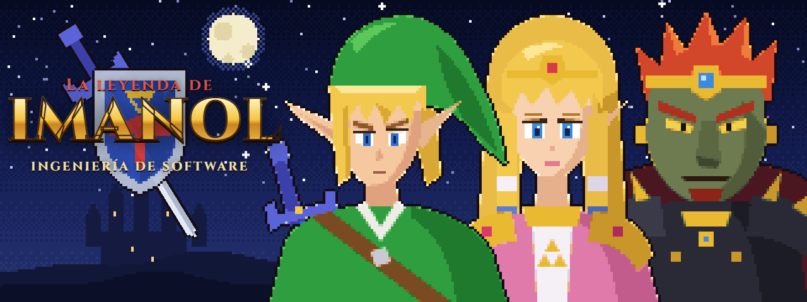
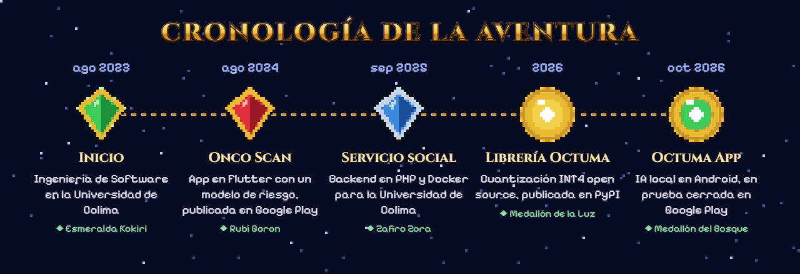

  

Soy Imanol, de Colima, y estudio Ingeniería de Software en la Universidad de Colima.

Me interesa que la IA corra donde está la persona, en su computadora o en su teléfono, sin mandar sus datos a ningún servidor. Por eso hice **Octuma**, una librería que comprime modelos de lenguaje a 4 bits, y una app para usarlos en Android. También hago apps en Flutter, backends y, de vez en cuando, juegos en Roblox.

  

| Objeto | Qué hace |
|---|---|
| **[Octuma](https://github.com/1mano1/octuma)** | Librería de Python que cuantiza modelos de lenguaje a INT4/INT8 con GPTQ y AWQ, y los exporta a GGUF para llama.cpp. En Qwen2.5-3B baja el archivo de 6.18 a 2.40 GB con un aumento de perplejidad del 2.43 %. `pip install octuma` |
| **[Octuma App](https://1mano1.github.io/octuma-app)** | Corre modelos de lenguaje dentro de un teléfono Android con llama.cpp, sin cuenta y sin nube. Está en prueba cerrada en Google Play. |
| **Onco Scan** | App en Flutter de apoyo a la prevención del cáncer de mama, con un modelo que estima el riesgo a partir de un cuestionario. Publicada en Google Play. |

  

- Sacar **Octuma App** de la prueba cerrada y publicarla en Google Play.
- Medir cuántos tokens por segundo da cada modelo en teléfonos de gama media.
- Terminar el certificado de Análisis de Datos de Google.

  <a href="https://1mano1.github.io">Portafolio</a> ·
  <a href="https://www.linkedin.com/in/imanolroguez">LinkedIn</a>

Fan art hecho por mí. The Legend of Zelda y sus personajes son de Nintendo.
